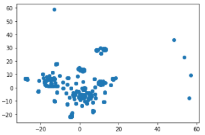

# Cryptocurrency Clusters

### Background

You are on the Advisory Services Team of a financial consultancy. One of your clients, a prominent investment bank, is interested in offering a new cryptocurrency investment portfolio for its customers. The company, however, is lost in the vast universe of cryptocurrencies. They’ve asked you to create a report that includes what cryptocurrencies are on the trading market and determine whether they can be grouped to create a classification system for this new investment.

### Data Preparation

* Discarded all cryptocurrencies that are not being traded. 

* Removed all rows that have at least one null value.

* Filtered for cryptocurrencies that have been mined. 

* Deleted the `CoinName` from the original dataframe.

* Used Pandas to create dummy variables for `Algorithm` and `ProofType`.

* Standardized dataset so that columns that contain larger values do not unduly influence the outcome.

### Dimensionality Reduction

* Performed dimensionality reduction with PCA. Using `PCA(n_components=0.99)` and `PCA(n_components=0.90)` 

* Further reduced the dataset dimensions with t-SNE, (only one distinct cluster)

**0.99 components**

**0.90 components**

### Cluster Analysis with k-Means

* Create an elbow plot 

**k-Means at .99 components**

**k-Means at .90 components**

### Recommendation

*PCA reduction done with both .99 and .90 and there was negligible difference between the two.  There was no discernable "elbow" feature on graphs. This would indicate the currencies cannot be divided into clusters.

